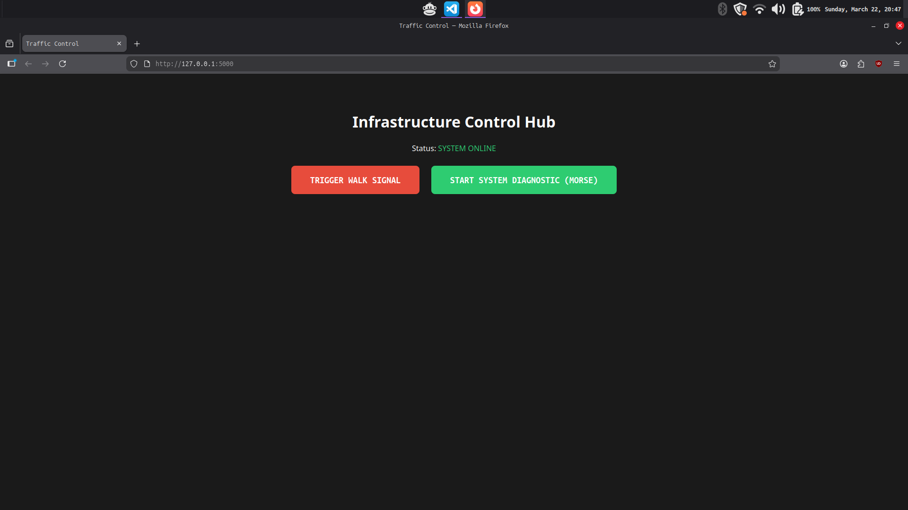

# Project: IoT Traffic & Signage Controller (Polycomp Demo)

## Project Overview
This is a Full-Stack IoT prototype designed to demonstrate how a web interface can control physical hardware. I built this specifically to showcase the core technologies used in professional electronic signage: **Web APIs, Serial Communication, and Embedded Logic.**

## How it Works
* **Frontend:** A simple web dashboard with dedicated controls for Walk and Dance (POLYCOMP Morse Code Seq.) modes.
* * **Backend:** A **Python Flask** server that processes web requests and relays commands to hardware.
* **Hardware:** An **Arduino (C++)** running a custom state machine to manage traffic cycles and Morse code encoding.

### Simple Dashboard Interface

---

## The "Polycomp" Morse Code Signature
To demonstrate custom data encoding and brand integration, I programmed a **"DANCE"** that flashes the company name across the LED array.

### **Timing Rules**
* **Dot:** 200ms
* **Dash:** 600ms
* **Intra-letter Space:** 200ms
* **Inter-letter Space:** 400ms

### **Signal Mapping**
| Letter | Morse Code | Visual Sequence |
| :--- | :--- | :--- |
| **P** | `. - - .` | Dot, Dash, Dash, Dot |
| **O** | `- - -` | Dash, Dash, Dash |
| **L** | `. - . .` | Dot, Dash, Dot, Dot |
| **Y** | `- . - -` | Dash, Dot, Dash, Dash |
| **C** | `- . - .` | Dash, Dot, Dash, Dot |
| **O** | `- - -` | Dash, Dash, Dash |
| **M** | `- -` | Dash, Dash |
| **P** | `. - - .` | Dot, Dash, Dash, Dot |

---

## Tech Stack
* **Languages:** C++, Python, HTML/CSS
* **Frameworks:** Flask (Backend)
* **Hardware:** ATmega328P Microcontroller (I used a Arduino Clone)
* **Tools:** PlatformIO, Git, Linux Terminal
